# MyAgentClaude

A multi-tier AI agent dispatch architecture for Claude Code, built to minimize Claude's own
metered token usage by pushing implementation, verification, and coordination work onto
already-paid, flat-rate subscriptions instead.

## Architecture

-
- **Claude** — strategic planner/architect. Never reads, edits, or runs code directly. Breaks a
  request into a plan and dispatches it.
- **`goose` / MiniMax-M3** — the default worker pool for small/single-file tasks and
  reconnaissance. Up to 5 concurrent workers, dispatched directly by Claude.
- **`agy` (Google Antigravity CLI)** — an optional tactical coordinator for large, multi-step
  goals. Claude hands it one goal (optionally with its own decomposition sketch for novel tasks);
  `agy` decomposes it into a DAG of up to 5 briefs, dispatches `goose`/MiniMax workers itself,
  retries ordinary failures, and returns one consolidated report.
- **Independent verification** — always a separate, freshly-dispatched worker reading raw
  artifacts, never the coordinator's own summary. Claude never trusts a worker's self-reported
  success.

```mermaid
flowchart LR
    %% Styling Classes
    classDef claude fill:#2B6CB0,stroke:#2B6CB0,color:#fff,rx:6,ry:6;
    classDef worker fill:#2F855A,stroke:#2F855A,color:#fff,rx:6,ry:6;
    classDef agy fill:#6B46C1,stroke:#6B46C1,color:#fff,rx:6,ry:6;
    classDef badge fill:#D69E2E,stroke:#B7791F,stroke-dasharray: 4 4,color:#000,rx:4,ry:4;
    classDef shortcircuit fill:#DD6B20,stroke:#C05621,color:#fff,rx:6,ry:6;
    classDef verify fill:#FFF5F5,stroke:#E53E3E,stroke-width:2px,color:#9B2C2C,rx:6,ry:6;
    classDef manual fill:#EDF2F7,stroke:#718096,stroke-dasharray: 4 4,color:#2D3748,rx:6,ry:6;
    classDef decision fill:#ED8936,stroke:#C05621,color:#fff;

    %% Main Flow
    Start(["[START] New Claude Code chat"]):::claude --> ClaudeArch["Claude — Planner/Architect only<br/><i>(never reads/edits/runs code directly)</i>"]:::claude
  
    %% Detached research node
    ClaudeArch -. "for deep research only" .-> ManualBox["Perplexity / GPT-5.6 / Kimi K3<br/><b>manual hand-off:</b> Claude states question,<br/>user runs it, reports back (no automation)"]:::manual

    ClaudeArch --> TaskSize{"Task size?"}:::decision

    %% Lane A: Small / Recon
    subgraph LaneA ["Lane A: Small / single-file / recon"]
        A1["Claude composes<br/>2–5 bounded briefs"]:::claude --> A2["Dispatch via goose run →<br/>MiniMax-M3 workers (≤5 concurrent)"]:::worker
        A2 --> A3["Pick best candidate<br/>from reports"]:::claude
    end

    %% Lane B: Large task
    subgraph LaneB ["Lane B: Large task — 3+ dependent briefs"]
        Badge["Scope discipline: chunk into 2-3 smaller runs<br/>if a wrong guess would be costly"]:::badge -.- B1
        B1["<b>Claude writes ONE goal:</b><br/>• <b>GOAL</b> — one sentence<br/>• <b>CONTEXT</b> — files, constraints<br/>• <b>DECOMPOSITION SKETCH</b> <i>(optional prior)</i><br/>• <b>HARD CONSTRAINTS</b> — checkable"]:::claude
        B1 --> B2["Dispatch to agy<br/>(Google Antigravity CLI) — once"]:::agy
        B2 --> B3["agy decomposes into DAG of ≤5 briefs<br/><i>(follows sketch if given, else own judgment)</i>"]:::agy
        B3 --> B4["agy dispatches goose/MiniMax workers<br/><i>(retries ordinary failures max 2)</i>"]:::worker
        B4 --> B5["<b>SHORT-CIRCUIT:</b><br/>• QUOTA_EXHAUSTED → BLOCKED<br/>• ASSUMPTION_INVALID → BLOCKED (cascade)"]:::shortcircuit
        B5 --> B6["agy returns ONE consolidated report<br/><i>(all BLOCKED briefs listed plainly)</i>"]:::agy
    
        %% Local Fallback
        B2 -. "fallback: quota/timeout/infra fail only" .-> B1
    end

    TaskSize -->|Small| A1
    TaskSize -->|Large| B1

    %% Converge to Verification
    A3 --> MergeDot((●))
    B6 --> MergeDot
  
    MergeDot --> V1["<b>Verification — Claude's job alone, never delegated</b><br/>① Reads RAW artifacts by finding run dir first<br/>② Checks against user's ORIGINAL request (prevents drift)"]:::verify
    V1 --> V2["Fresh independent goose worker<br/>checks evidence → <b>PASS / FAIL</b>"]:::worker
    V2 --> V3["Claude reads raw verification report"]:::claude
    V3 --> EndNode(["[END] Claude replies to user<br/><i>(BLOCKED pieces flagged, re-dispatch decided)</i>"]):::claude
```

## Files

- `CLAUDE.md` — the full governing configuration: the worker-only execution contract, the mandatory
  parallel fan-out rule, the `agy`-coordinator pattern, dispatch conventions, and hardening rules
  (scope discipline, decomposition-sketch input, `QUOTA_EXHAUSTED`/`ASSUMPTION_INVALID` handling).
- `agy-swarm/AGY_COORDINATOR.md` — the policy `agy` follows when acting as coordinator: input
  contract, decomposition rules, worker assignment, retry policy, consolidation, hard prohibitions.
- `agy-swarm/SWARM_PROTOCOL.md` — message formats, schemas, and the coordinator's fan-out loop.
- `agy-swarm/swarm-team.yaml` — the worker roster and routing/retry defaults `agy` reads at
  run start.
- `agy-swarm/WORKFLOW_DIAGRAM_PROMPT.md` — a text-to-image prompt (for Gemini) that renders the
  full architecture as a diagram.

## Status

The coordinator pattern has been validated end-to-end, including real failure recovery: a genuine
DAG with a dependent brief that failed and was correctly retried, and a separate test where `agy`
independently produced a sound decomposition with no prescribed structure. See `CLAUDE.md` for the
full rule set and rationale.
