# MyAgentClaude

**Claude is the architect. Cheap workers write and test. A third worker grades the evidence. Nobody grades their own work.**

MyAgentClaude is an operating protocol for [Claude Code](https://claude.com/claude-code): Claude plans, a MiniMax worker pool implements, an optional coordinator (`agy`, Google Antigravity CLI) runs large DAGs, and a fresh worker verifies raw artifacts against the user's original request.

This repository is the spec. It is not an app, not a hosted agent, and not a benchmark. Clone it for the contract, the schemas, and the diagram.

[Architecture](docs/architecture.md) · [Media kit](docs/media.md) · [Operator setup](docs/operators.md) · [Example run](examples/run/)

## Why it exists

Expensive frontier models are a bad default for "read the repo, edit the file, run the tests." They burn quota on work a flat-rate worker can do. They also grade their own homework.

MyAgentClaude splits the loop:

| Role | Who | Allowed to do |
| --- | --- | --- |
| Architect | Claude | One plan, bounded briefs or one goal, review of **reports only** |
| Coordinator (optional) | `agy` | Decompose a large goal into ≤5 briefs, dispatch, retry, consolidate |
| Workers | `goose` + MiniMax-M3 | Recon, implement, test, shell — up to 5 concurrent |
| Verifier | Fresh `goose` worker | Read raw artifacts + original user request → PASS/FAIL |

Claude never reads or edits the target codebase. The coordinator never verifies. A worker never certifies its own success.

## How a request flows

```mermaid
flowchart LR
    classDef claude fill:#2B6CB0,stroke:#2B6CB0,color:#fff;
    classDef worker fill:#2F855A,stroke:#2F855A,color:#fff;
    classDef agy fill:#6B46C1,stroke:#6B46C1,color:#fff;
    classDef badge fill:#D69E2E,stroke:#B7791F,stroke-dasharray: 4 4,color:#000;
    classDef shortcircuit fill:#DD6B20,stroke:#C05621,color:#fff;
    classDef verify fill:#FFF5F5,stroke:#E53E3E,stroke-width:2px,color:#9B2C2C;
    classDef manual fill:#EDF2F7,stroke:#718096,stroke-dasharray: 4 4,color:#2D3748;
    classDef decision fill:#ED8936,stroke:#C05621,color:#fff;

    Start(["START: New Claude Code chat"]):::claude --> ClaudeArch["Claude — planner / architect only"]:::claude
    ClaudeArch -. "deep research only" .-> ManualBox["Perplexity / GPT-5.6 / Kimi K3 — manual hand-off"]:::manual
    ClaudeArch --> TaskSize{"Task size?"}:::decision

    subgraph LaneA ["Lane A — small / single-file / recon"]
        A1["Claude writes 3 to 5 bounded briefs"]:::claude --> A2["goose run → MiniMax-M3 workers, at most 5 concurrent"]:::worker
        A2 --> A3["Claude picks a candidate from reports"]:::claude
    end

    subgraph LaneB ["Lane B — large goal, 3+ dependent briefs"]
        Badge["Scope discipline: 2–3 smaller runs if a wrong split is expensive"]:::badge
        Badge -.- B1
        B1["One GOAL + CONTEXT + optional DECOMPOSITION SKETCH + HARD CONSTRAINTS"]:::claude
        B1 --> B2["Dispatch agy once"]:::agy
        B2 --> B3["agy builds a DAG of at most 5 briefs"]:::agy
        B3 --> B4["agy dispatches goose workers; ordinary retries max 2"]:::worker
        B4 --> B5["QUOTA_EXHAUSTED or ASSUMPTION_INVALID → BLOCKED, no retry"]:::shortcircuit
        B5 --> B6["One consolidated report; BLOCKED briefs listed plainly"]:::agy
        B2 -. "agy quota / timeout / infra fail" .-> B1
    end

    TaskSize -->|small| A1
    TaskSize -->|large| B1
    A3 --> MergeDot(( ))
    B6 --> MergeDot
    MergeDot --> V1["Verification is Claude's job — never delegated"]:::verify
    V1 --> V2["Fresh goose worker checks raw evidence → PASS / FAIL"]:::worker
    V2 --> V3["Claude reads the raw verification report"]:::claude
    V3 --> EndNode(["END: reply to the user; flag BLOCKED work"]):::claude
```

Lane A is the default. Lane B is only for goals that actually decompose into three or more dependent briefs. Both lanes merge into independent verification.

## 60-second adopt

1. Copy `CLAUDE.md` into a Claude Code project (or `~/.claude/CLAUDE.md`).
2. Copy `agy-swarm/` next to it if you want the coordinator pattern.
3. Export `MINIMAX_API_KEY` in the shell that will run `goose`. Never print the value.
4. Confirm `goose` and, optionally, `agy` are on `PATH`.
5. Start a Claude Code chat and give it a real repo task. Claude should dispatch workers, not edit files.

Details: [docs/operators.md](docs/operators.md).

## Protocol, not vibes

- Briefs are narrow: one file, one change, mechanically checkable `done_criteria`.
- Parallel editors never share a working directory. Competing edits use git worktrees.
- Every brief starts with: ground claims in the repo, no nested agents, never read credential files.
- `agy` may retry ordinary failures twice. It must not retry quota walls or false assumptions.
- Verification reads `.runs/<run_id>/` by listing files first. It does not assume a schema was followed.
- Verification also carries the user's original request, not only Claude's compressed GOAL.

Normative files:

- [`CLAUDE.md`](CLAUDE.md) — architect contract, fan-out, dispatch templates
- [`agy-swarm/AGY_COORDINATOR.md`](agy-swarm/AGY_COORDINATOR.md) — coordinator policy
- [`agy-swarm/SWARM_PROTOCOL.md`](agy-swarm/SWARM_PROTOCOL.md) — schemas and loop
- [`agy-swarm/swarm-team.yaml`](agy-swarm/swarm-team.yaml) — roster and caps
- [`examples/run/`](examples/run/) — illustrative artifact layout

## Who this is for

Developers building Claude-as-brain, other-model-as-hands systems, and anyone who needs an audit trail that cannot be forged by the worker who did the work.

Media covering AI coding agents: this is a factory design, not a chatbot persona. See [docs/media.md](docs/media.md).

## Status

Spec and coordinator pattern, validated on a small end-to-end DAG with retry, 2026-09-15. No hosted service. No SLA. Issues and PRs that tighten the protocol are welcome.

## License

MIT. See [LICENSE](LICENSE).
